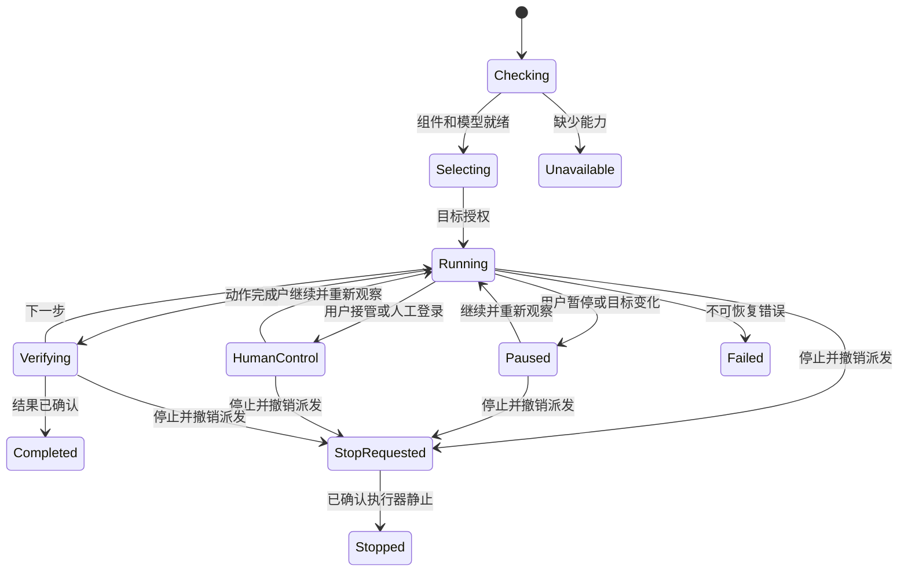
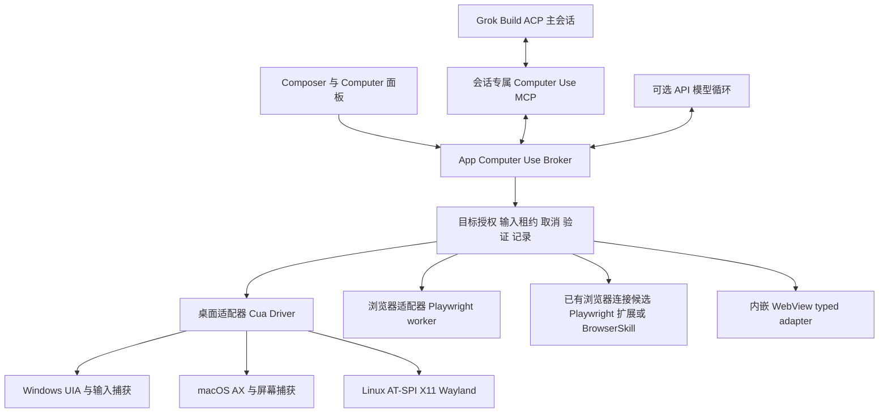

# Grok App Computer Use：三平台首版方案与开发计划

> [!NOTE]
> 本文件保留产品目标、ADR 与验收范围；它不是当前进度来源。2026-09-09 起，具体施工顺序见 [Grok 逐步开发总计划](2026-09-09-computer-use-grok-step-plan.md)，真实状态见 [执行状态账本](2026-09-09-computer-use-execution-state.md)。

日期：2026-09-08。状态：待审核设计，开发未开始。用户已明确要求 Windows、macOS、Linux 从首版一起支持。

分支：`feat/computer-use-design`。基线：`upstream/main` `30757366a739ec9aaf0ccc95bbb3efe19a067aa9`。本次只交付调研与方案，不推送、不创建 PR。

调研证据、开源许可证、固定源码版本及当前缺口见 [调研报告](../research/2026-09-08-computer-use.md)。本文件描述拟实现行为，不代表功能已上线。

已补入 [Codex / Pi / DeepSeek Harness / Claude Code 框架对照](../research/2026-09-08-computer-use-harness-comparison.md)：新增 ADR-5 与 P0/P1/P2/P8 验收项。对照层级为官方文档与 Pi/DSH 定向源码，没有声称审计 Codex/Claude Code 完整引擎。

已补入 [12 个 DSH 第三方插件的源码调研](../research/2026-09-08-dsh-third-party-plugins.md)：BrowserSkill 进入已有浏览器连接候选，完善按需预览、借用归还、会话隔离、停止和恢复要求；这些插件尚未安装或完成运行验证。

交给 Grok 开发时使用 [开发交接](2026-09-08-computer-use-grok-handoff.md)和 [长任务 Goal 提示词](2026-09-08-computer-use-grok-goal.md)：先做 P0，阶段验收后自动续接 P1–P9，最终统一交付用户审核，不再逐批等待“继续”。交接本身不表示开发已开始。

## 1. 产品目标与首版范围

用户在现有会话中选择一个应用、窗口或浏览器标签页，说出任务，Grok 能观察界面、操作并验证结果。用户始终能看见当前目标、知道是否占用前台，并能立即暂停、接管或停止。

首版不是三个系统只显示同一个按钮；以下共同能力必须在发布支持矩阵中闭环：

| 能力 | 首版交付 |
| --- | --- |
| 目标选择 | 运行中的应用/窗口、已安装应用启动、浏览器 tab；显示能力和授权范围 |
| 观察 | 窗口/选定共享区域截图、可访问性树、焦点、窗口尺寸与缩放；按需刷新 |
| 操作 | 语义点击/值修改、坐标点击、键盘、Unicode 文本、滚动、拖拽；不支持的动作明确拒绝 |
| 浏览器 | 受管 Chromium、DOM/AX、截图、导航、多 tab、表单、下载/上传、人工登录续用；已有 Chrome/Edge tab 通过扩展显式连接 |
| Agent 循环 | 观察 → 决策 → 执行 → 验证；多轮连续任务、失败恢复、避免重复提交 |
| 人机协作 | 目标授权、任务进度、暂停/继续、接管、快捷停止、人工处理登录/验证码 |
| 持久化 | 任务摘要、动作元数据、可选证据快照、错误与耗时；恢复会话时重新验证目标和授权 |
| 发行体验 | 三平台驱动安装/更新/回退、权限诊断、多屏/DPI、中文输入、断线/锁屏/退出处理 |

首版不包括云电脑托管、锁屏无人值守、UAC/管理员安全桌面、任意应用后台输入、录制任意操作后无条件重放、桌面并发多 Agent、移动端模拟器专用集成。它们不影响三平台本机有监督 Computer Use 的共同核心。

### 发布支持矩阵

沿用项目四个发行 target：Windows x64、macOS arm64/x64、Linux x64。以下是拟定验收环境，P0 根据驱动最低系统要求锁定具体版本，不提升整个 Grok App 的系统要求来掩盖可选功能限制。

| 系统 | 首版要求 | 差异和发布规则 |
| --- | --- | --- |
| Windows 11 x64；Win10 22H2 兼容验证 | 原生 Win32/WPF/WebView2、浏览器、常规前台操作 | UIPI、锁屏和提权窗口不在支持范围；后台语义动作可选，不承诺所有动作后台完成 |
| macOS Apple Silicon + Intel | 原生 AppKit/SwiftUI、WKWebView、浏览器 | P0 锁定各架构最低 OS 版本；同时验证签名后 Screen Recording/Accessibility，不以开发机 terminal 权限代替 |
| Ubuntu 24.04 x64，GNOME Wayland + X11 | GTK、Electron/Tauri、浏览器，完整共同核心 | GNOME helper/portal 如为必要依赖，必须提供可见安装和恢复流程；Wayland 未通过，不能宣布三平台首版完成 |
| KDE Plasma 6 / Sway 等 Linux 桌面 | 首版提供检测与能力报告，支持已验证的动作子集 | raw input、窗口身份等缺口列出；不能静默借 XWayland 或全局输入冒充原生支持；完整支持需后续独立验收 |

“三平台一起支持”在本方案中意味着上述 Windows、macOS、Ubuntu GNOME/X11 基线一起发布；不把某个 OS 的原生桌面能力延期到第二版。其他 Linux 合成器的兼容级别逐项列明，不宣称覆盖所有发行版。

## 2. 使用流程与界面融合

入口放在 Composer 的工具/附件菜单与 `@` 目标选择中：**使用电脑**、**浏览器**、具体应用。设置集中在“扩展 → Computer Use”二级页，诊断链接至运行时；不放进外观/壁纸设置。

1. 首次启用：检查驱动、模型看图能力和系统权限。只解释当前缺少的一项，并给出打开系统设置/安装组件的操作。
2. 选择目标：默认选窗口或 tab；展示应用图标、标题、范围和“会占用鼠标键盘/可后台”。Wayland 如只能可靠绑定共享区域，使用系统 picker 选择区域并明确范围，不能伪装成应用独占权限。
3. 发起任务：普通点击、填写和滚动在已批准任务范围内连续执行。新增应用/站点或明显超出任务范围时才扩展授权，避免每一步弹窗。
4. 运行中：聊天里一张任务卡，右侧资源区显示 Computer 面板。面板只保留当前目标、最近画面、当前动作和“暂停 / 接管 / 停止”。动作明细折叠，技术诊断留在详情。
5. 登录/验证码：停止自动输入，暂停对人工敏感输入阶段的采集；用户直接在目标应用完成，点击继续后重新观察。不能让模型猜验证码或把密码粘贴进会话。
6. 完成：给出结果、验证依据和产物链接。操作系统返回成功不等于任务成功；无法确认时标“待确认”，不给绿色完成。

输出文件复用资源面板预览。上传由用户选定路径/任务授权范围约束，下载绑定 browser/run 与 App 管理的 staging 路径，校验实际路径、重定向、文件大小和保存目标后交付；不能把模型给的路径直接传给任意文件操作。剪贴板默认不读取；中文输入优先原生 Unicode/语义写入，必须借剪贴板粘贴时只写入明确任务文本，并用版本检查恢复，避免覆盖用户期间新复制的内容。

窄窗口下 Computer 面板作为可切换资源 tab；暂停/停止入口仍在任务卡和全局运行指示处。切聊天只改变展示，当前电脑任务的全局指示始终可见；第二会话请求输入时排队或让用户接管，不能隐式抢占。



示例产品文案：`正在操作「计算器」`、`需要你完成登录`、`窗口已关闭，请重新选择`。不在主流程显示 IPC、OAuth、MCP、坐标映射等实现说明。文案实现时同步 15 个 locale。

## 3. 架构决策



### ADR-1：模型入口沿用 Grok Build，执行能力由 App 管

首版通过已存在的 ACP 注入专属 MCP。MCP 是协议适配面，不直接持有整个桌面的无限权限。Broker 持有当前任务、目标和允许动作，模型只收到可引用的 handle。

普通聊天保持现有工具集合。Computer Use 启用必须显式关联 `appSessionId/runId`，独立于 `official_aux_with_user_mcp`；不会为了加 Computer Use 自动加载所有用户扩展。官方路由不注入 `official-aux` 的现行规则保持有效。

如果连接预算超时、MCP 初始化失败或模型看不到图，UI 显示具体不可用原因。不得只把 skill 提示词加给模型后让它猜工具。

### ADR-2：Cua Driver 作为可替换桌面实现

优先通过固定版本、私有子进程/SDK 接口适配 Cua Driver；原始 Cua CLI/MCP 不直接注册给 Agent。只开放我们发布的动作子集，关闭独立 shell、任意文件读取、进程终止、历史扫描、自动录屏等不属于本任务的能力。

Broker 在 Tauri Rust Host；慢调用在独立 worker/sidecar，不能阻塞 UI/main thread。Cua 原生代码不直接装入渲染进程。macOS 优先采用其受支持的 App-owned embedded host 生命周期，核实 Rust/Tauri 宿主方式及签名后再定具体 API。

驱动启动使用 `bounded` 及经过用户目标选择生成的窄范围 manifest；不能用默认 promptless `standard` 代替 App 授权。权限变更需要按上游生命周期重启时，立即撤销旧代际、拒绝旧调用，重新观察后才恢复。

选择失败的标准：支持矩阵不能构建/交付、目标/取消边界无法实现，或关键 native 测试不过。失败时按统一适配器接口补 OS 原生实现，记录明确缺口与成本，不临时换成全局脚本盲点。

### ADR-3：浏览器走结构化控制

受管 Chromium 是完整浏览器路径：由 App 托管 Playwright worker、固定 Node/Playwright/browser 版本，可复用本机安装的合格 Chrome/Edge。独立用户数据目录，命名 profile 持久登录，每个 profile 同时只允许一个拥有者；清除登录数据提供单独用户操作。

已有 Chrome/Edge 登录 tab 的连接方式在 P0 对比 Playwright 扩展与 Tencent BrowserSkill，后者的 DSH 第三方插件已有借用/归还和预览实现。只选择通过验收的一条默认路径，不让两个控制器同时操作同一个 tab；受管浏览器仍优先 Playwright。

只接受用户选择的 tab，Host 绑定 appSessionId/runId/browser/profile/tab 身份；不能只校验“本插件创建的 session”，也不能共享一个全局 current tab。扩展断开后暂停，重连复验身份。Cookie/Token 留在浏览器，不导出进聊天。连接已有账号不等于允许访问所有标签页。

如采用借用式连接，先显示目标和将发生的位置变化，批准后记录原窗口/索引；结束时归还用户 tab，只清理 App 创建的资源。用户关闭原窗口、移动 tab、借用中取消或断线要有明确恢复行为；不能以“清理会话”为由关闭用户原 tab。配对必须验证实际扩展身份和连接代际；仅校验 Origin 长得像 chrome-extension 地址不够。

复用 Playwright 的 locator、auto-wait、截图和下载机制，通过 Broker 包装固定 typed 操作。`browser_run_code_unsafe`、任意 `evaluate`、Cookie/storage 全量读出不进入模型工具面。Playwright 的 `allowed-origins` 不是安全边界，也不管所有重定向，必须在导航、弹窗、下载/上传前后重验实际目标。

内嵌 WebView 沿用 `side_browser_host`，增加受控 snapshot/element action。禁止直接公开其任意 `eval`。跨域 iframe、浏览器权限 UI、复杂下载等不能证明等价时，提示在受管浏览器继续并由用户重新登录，不暗中搬运 Grok 相册的认证数据。

### ADR-4：单桌面输入互斥，后台能力按动作报告

同一用户桌面同时只有一个 active input lease，App 多窗口、不同会话、多个实例都必须遵守。受管浏览器不同 profile 可独立执行不涉及 OS 输入的操作；使用原生文件对话框就要申请桌面输入租约。

输入租约按 Computer Use run 持有，任务结束且 worker 静止后释放；不会像 Claude Code CLI 所描述的机器锁那样一直保留到整个聊天会话退出。恢复原聊天不自动重拿租约。

后台语义动作仅在 driver 宣告并经测试的路径开放；不支持时询问是否切到前台，不能悄悄降级并抢用户输入。用户主动输入、目标焦点漂移、锁屏、显示器拓扑变化会暂停前台自动化。Wayland 若无法可靠监听全局接管，使用可见停止控件和 portal 撤销，不伪报全局热键可用。

能力报告区分语义后台动作、定向进程事件、前台全局输入；可见的虚拟光标只表示操作位置，不证明输入隔离。没有目标或旧句柄失效时直接拒绝，禁止偷偷回退到 desktop scope。私有 macOS SkyLight 路径按具体系统/应用测试，不视为跨平台能力。

### ADR-5：统一操作运行时，吸收 Pi/DSH 的可扩展性

参考 Pi 的 typed tool、上下文转换和取消契约，DSH 的能力接口、guard 与结果投影，Broker 内部使用直接类型化 API；MCP 只是一层模型协议适配器，UI 不绕回 MCP。无须把 Pi 或 DSH 整套运行时装进 Grok App。

每个 backend 声明 `protocolVersion`、`capabilities`、`executionMode`、`replayPolicy`、`generation` 和 `dispose` 责任。桌面输入默认 `exclusive / replay=never`；这些是 Host 元数据，模型不能在参数里自称可并行或可重放。开始新任务时固定 registry 版本，驱动更新先停止活跃任务再切代际。

执行顺序为：解析 → 参数转换 → 最终 Schema 校验 → 固定身份/权限 guard → 输入租约与取消检查 → driver → 规范化执行结果 → 结果验证 → UI/模型投影。扩展只能在指定位置运行，不能改变工具名、run/target 身份、权限代际或抹掉已拒绝状态；driver 前再次检查取消和目标状态。超时 wrapper 必须保留并组合根取消信号。

每次执行产生同一个规范结果，UI 进度和诊断信息不默认送入模型。日志/展示钩子不能把 `unknown/rejected` 改成 `verified`；后处理失败单独记录，不能因此重新执行已发生的输入。迟到进度回调在调用结束或 generation 变化后丢弃。

首版小批动作继续使用有界 typed sequence。若后续引入 DSH PTC 或 Codex 风格的代码执行，每个子动作必须走相同授权、审计与取消流程；没有独立隔离的任意 JS/Node 执行不进入本机桌面功能。

会话持久化只恢复任务意图、已验证事实与产物引用；fork/resume/compaction 后废弃旧快照、元素引用、授权租约和待执行动作，重新观察。外部应用不会随聊天 rewind 自动回滚，也不得把“恢复会话”实现成重放键鼠事件。

恢复调度区分网络暂时失败、永久错误、用户停止与权限拒绝，带宽限期、退避和次数上限；先检查宿主是否已自行恢复。自动恢复记录明确的系统来源，不伪造用户新消息或扩大授权。未知输入结果必须先观察；“提示模型不要重复执行”不能代替 Broker 的动作状态检查。人工停止、锁屏或拒绝后不得自动续跑。

上下文裁剪分两层：App 始终限制新工具结果大小并清楚标注过期观察；清理 Grok Build 已积累的历史图片，需要 P0 验证真实 hook/协议支持。不能因 Pi 存在 `transformContext` 就声称 ACP 下也能任意修改历史请求。

## 4. 工具与数据契约草案

这些是 **App 拟定义协议**，不是 Grok/Cua 已发布 API。P0 固定 JSON Schema 和版本后实施。

| 工具 | 作用 |
| --- | --- |
| `computer_status` | 当前 run、平台能力、授权、输入是否被占用 |
| `computer_list_targets` | 可选择的应用/窗口；只返回选择所需元数据，不自动抓取所有窗口内容 |
| `computer_open_target` | 从已发现应用或已授权 browser handle 打开目标；无任意 exe/shell 路径 |
| `computer_observe` | 返回指定目标的截图、语义节点、焦点和 snapshotId |
| `computer_act` | 执行一个动作或受限动作序列；语义与坐标目标互斥 |
| `computer_wait` | 有时限地等待指定状态变化，支持取消 |
| `computer_request_handoff` | 等待用户选择目标、扩大范围或完成手动步骤；不会自己批准 |
| `browser_list_tabs` / `browser_open` | 在已批准 browser/profile 内管理 tab |
| `browser_observe` / `browser_act` | 页面可访问性、截图、表单、导航；沿用相同 run/target 校验 |

暂停、恢复、撤销授权、停止属于 UI/Host 控制接口；模型不能调用“批准自己”接口。

```ts
type Observation = {
  version: 1;
  runId: string;
  targetId: string;
  targetGeneration: number;
  snapshotId: string;
  capturedAt: string;
  geometryRevision: number;
  coordinateSpace: "image_pixels";
  image: { width: number; height: number; contentId: string };
  nodes: Array<{ ref: string; role: string; name: string; actions: string[] }>;
  truncated: boolean;
};

type ActionRequest = {
  version: 1;
  actionId: string;
  runId: string;
  targetId: string;
  targetGeneration: number;
  snapshotId: string;
  geometryRevision: number;
  action: "click" | "set_value" | "type_text" | "key" | "scroll" | "drag";
  target: { elementRef: string } | { x: number; y: number };
  parameters: Record<string, unknown>;
};
```

实际 Schema 对每个 action 使用独立判别分支与 `additionalProperties: false`，键盘组合、文本长度、滚动、拖拽时长均有限制；上例只展示共通字段。

身份与坐标规则：

- `targetId` 绑定进程实例和窗口生命周期；不能只信 PID、标题、HWND 或 Wayland node ID，因为它们会复用。
- 元素引用只在对应 snapshot 内有效。窗口移动/缩放/跨屏、DOM 导航、授权撤销会使相关 handle 失效。
- 模型只使用截图像素坐标；Broker 保存裁剪原点、DPI、逻辑坐标与物理坐标的变换，禁止模型自行猜缩放比例。
- CLI 可能再次缩放工具图片。P0 用带坐标标记的合成图验证最终视觉尺寸；在 Broker 预先生成适配当前 CLI 的图片并返回相符元数据。遇到未知缩放不能盲信原始屏幕宽高，坐标模式须拒绝或重取已验证尺寸的局部图。
- 执行前重新验证目标和当前几何。快照过期/焦点变化拒绝并要求重新观察，不能重放旧坐标。
- 输入 API 成功后再次观察，结合页面/fixture/产物验证效果；结果状态区分 `applied`、`verified`、`rejected`、`unknown`。
- `actionId` 用于在同一 run 中去重。网络/driver 超时可能已执行，标 `unknown` 并先观察；不可自动重试发送、购买、删除等最终提交动作。无法承诺崩溃前后物理动作 exactly-once。

`computer_observe` 要能返回多张有各自原点/层级的子窗口和弹出菜单截图；目标窗口产生的对话框须验证所属进程与授权范围。捕获不到的菜单、全屏或受保护画面返回明确不可观察状态，不能拿旧截图继续操作。

## 5. 权限、取消与隐私如何进入实际流程

权限分两层：系统授予捕获/输入能力；用户在 Grok App 中授予特定任务的目标和动作范围。文件 `acceptEdits` 或聊天 YOLO 不自动等同于“可操作所有桌面应用”。

任务范围内的常规操作自动执行；新目标、新站点、外发/付费/删除等未被原请求明确授权的动作，显示一次具体预览后确认。批准绑定动作内容和目标，不复用过期确认，不要求用户为同一范围重复确认。

授权实现必须在 Broker/driver 内生效，不能只靠 skill。页面、窗口文字和截图是任务数据，不能改变授权或指示 agent 开放新工具。判断动作风险存在不确定性时请求用户接管，不声称能从所有像素准确识别敏感操作。

也必须诚实说明边界：有任意本机 shell 权限的 Agent 或同用户恶意进程可能绕过 Computer Use API。此方案的 Broker 权限约束不是操作系统级沙箱。P0 验证 Computer Use 专属运行模式的实际工具限制；若 CLI 无法可靠禁止绕行，只能标为有监督自动化，不能宣传成隔离安全执行。无监督强隔离需后续 VM 路线。

当前 Grok 宿主的授权弹窗、密钥输入、终端与 Computer 控制面默认不成为可控目标，不进入模型观察；禁止通过坐标、AX 或浏览器适配器点击自己的授权按钮。复现 Grok App 自身 UI 时使用独立 dev 实例，并保留外部停止通道。无法排除宿主控制面的截图暂停发送。

停止顺序：先撤销 input lease/递增 cancellation epoch、拒绝队列，通知 driver 中断并释放按下的键鼠，再取消 ACP 回合。超时终止 App 自有 worker；不得关闭用户目标应用。进程退出、连接断开、用户撤销权限均触发同一顺序。

原生不可中断调用可能已发出，停止后不派发新动作，剩余状态诚实标记。重启 driver 不自动恢复上轮输入，必须重新绑定目标。App 最小化/关闭到托盘与真正退出区分：运行任务仍显示全局指示和停止入口。

停止状态区分 `stop_requested` 与 `stopped`：前者表示已撤销继续派发权限，后者必须有 worker 静止/进程终止证据。等待停止时不抢先移交输入租约；所有旧回调带 run/action/generation 校验。

尤其要验证 Promise reject、CLI 子进程退出与浏览器/原生动作静止之间的差异。Playwright 调用可能在外层取消后继续执行；执行器仍未静止时保持 `stop_requested`，不能先释放页面租约给下一任务。

截图默认在内存中，仅保留当前观察和有上限的短期缓存；本地记录默认不存完整截图、原始按键、密码、Cookie 或整棵树。用户选择保留证据时才写受控 App data 子目录，提供保留期限和清除操作。

模型需要的观察会送往当前模型服务。App 本地不落盘不等于 Grok Build 的会话日志或服务端也不留存；P0 检查 CLI 图片/日志行为，并在功能首次启用时准确说明。脱敏能力不能承诺过滤所有屏幕隐私；人工敏感步骤应暂停采集。

IPC 优先 App 私有管道/socket + 当前用户访问控制，连接具备短期 run 凭证并验证代际，不绑定公网。凭证不放命令行、聊天或普通日志。OS 同用户权限不是强对抗隔离，此限制保留在设计说明中。

远程 IM、定时任务、SSH 会话和子 Agent 首版默认不继承本机 Computer Use 授权；未打开本地任务控制面、未获得目标授权的调用直接拒绝。以后开放远程发起时需要单独的设备和目标授权设计。

## 6. 模型、速度和体验

首版默认沿用当前会话模型和推理强度。现有官方静态默认为 `grok-4.6 / xhigh`，实际以当前 catalog 和用户偏好为准；不因开发 Computer Use 擅自改账户、provider 或全局默认。

只有端到端看图探测通过才开放坐标操作。纯文本模型可使用可靠 AX/DOM 语义子集；Canvas/无节点区域需切换到用户配置的视觉模型，不能把“自动描述一张图”当等价的交互式坐标理解。

减少等待的优先顺序：

1. 用户打开目标选择器后只预热驱动/浏览器组件，不提前截图个人窗口、不提前调用付费模型。
2. 会话内复用 driver、browser 和 MCP 连接，避免每步启动 CLI/浏览器或创建新聊天。
3. 语义节点按窗口/区域裁剪，截图先取适合阅读的分辨率，细节不够再取局部高分辨率；映射保持可验证。
4. 同一已观察页面可执行有前置条件的小批动作，初始上限 3 个；每个动作仍独立审计，遇导航/弹窗/提交/错误立即停止批次。动态目标不靠固定 sleep。
5. 暂停和进度由本地状态驱动，模型思考时也能立即响应用户；不展示虚构百分比。

UI 实时预览与模型观察分开：只在预览可见且目标获授权时周期采集，收起或关闭预览后停掉周期截图；模型主动 `observe` 仍按任务需要执行。预览不能占满动作队列，可丢弃旧预览帧，不能丢弃动作结果。保留最后一帧避免闪烁时必须标出过期/断连状态，旧帧不能作为输入依据。

预览事件采用同一条有序流的初始 snapshot + 增量 revision，断流重连先重置快照，再应用新代际增量。执行轨迹默认紧凑展示观察、动作、验证和人工等待，详情显示目标、耗时和失败原因；调用成功不自动标成任务验证成功。模型、driver、授权等待和重试耗时分别记录，嵌套/并发时间不相加冒充总耗时。

P0/P8 对同一模型真实支持的 `low/medium/high/xhigh`、单动作/3 动作和 AX+截图/纯截图做对照。先记录当前继承值，再考虑增加本功能独立的“速度优先/稳妥”配置；不先决定最低思考档。

性能预算是验收目标，**不是已有测量**：本地暂停确认 p95 < 200 ms；停止后不派发新动作；支持中断的 worker 1 秒内静止；本地普通观察 p95 < 1 秒、复杂目标单列；界面不因驱动调用阻塞。模型阶段分别记录首动作时间、决策时间、工具时间、完整任务时间、图片/token 消耗。

## 7. 模块落点与兼容

拟新增独立领域模块：

```text
src/components/computer-use/       # 目标选择、任务卡、预览、权限、诊断
src/hooks/computer-use/            # run lifecycle、事件订阅、面板控制
src/lib/computer-use/              # 契约、capabilities、错误与展示 helpers
src-tauri/src/computer_use/        # Broker、权限、输入租约、观察缓存、事件
src-tauri/src/computer_use/adapters/ # Cua、原生备选、WebView
tools/computer-use-browser/        # 固定版本 Playwright worker
docs/llm-wiki/computer-use.md       # 实现稳定后补实际契约，不能先宣称上线
```

现有连接点只做小范围接线：ACP MCP builder、session stop/exit、资源面板注册和 Composer 菜单。`App.tsx` / `AppWorkbench.tsx` 不增加大块状态，遵守增长冻结；大模块按职责拆分，遵循现有质量门禁，不用豁免掩盖新增大文件。

系统设置在 `settingsCatalog` 注册，复用 Select/GlassModal/ContextMenu。产品弹窗使用项目组件；系统权限 picker 是 OS 必需流程，不能自画一个假系统授权框。

不能改写共享 `~/.grok` 来永久安装本功能。会话注入与 App-owned private runtime 为首选；如原型确需隔离 agent home，必须独立路径并记录凭据生命周期，不覆盖原账户。沿用 App 代理配置，loopback IPC 不走外部代理；不硬编码本机 10808/10809。

与壁纸/Imagine 的融合只复用资源面板和打开页面能力。已登录相册窗口、Cookie、壁纸搜索权限不会自动授权给新 Computer Use 会话。

## 8. 分批开发计划

所有阶段当前均未开始。小 PR 可依赖前一批合并；各系统驱动开发顺序不等于发布顺序，三平台共同核心全部通过后才启用首版。

| 阶段 / 建议 PR 边界 | 交付 | 必须验收 |
| --- | --- | --- |
| P0 `test(computer-use): validate model and driver contracts` | 可重复合成图 MCP 探针、CLI 版本/工具限制报告；四 target 构建、Cua 权限/取消 spike；已有 tab 的 Playwright 扩展/BrowserSkill 比较；锁定依赖与最低 OS | 模型看图证据；纯文本拒绝坐标；macOS 签名身份；Linux GNOME/X11 不偷降级；浏览器归属/配对/取消证据；形成 go/no-go 结论，不默认装用户驱动 |
| P1 `feat(computer-use): add broker and runtime lifecycle` | 版本化协议、私有 IPC、driver 生命周期、feature flag 默认关闭 | 断线/退出/重启、非法参数、旧代际/重复 actionId、跨 App 实例输入互斥 |
| P2 `feat(computer-use): add scoped access and takeover` | 目标授权、输入租约、队列/取消、最小可见的暂停接管 UI | 未授权输入零执行；用户拒绝不循环询问；取消中的输入无新派发，键鼠释放；15 locale |
| P3 `feat(computer-use): support Windows desktop` | Cua Windows adapter、UIA/WGC、前台输入、诊断 | Win32/WPF/WebView2/Electron、125/150/200% DPI、多屏负坐标、中文、窗口复用、锁屏/UIPI 拒绝 |
| P4 `feat(computer-use): support macOS desktop` | App-owned embedded driver、AX/capture/input、权限设置链路 | Intel+ARM 签名安装，首次允许/拒绝/撤销；AppKit/SwiftUI/WKWebView；Retina、多屏、中文 |
| P5a `feat(computer-use): support Linux X11` | AT-SPI、截图、X11 输入、发行包依赖检测 | GTK/Electron/Tauri；真实 Xorg 与 headless 测试区别；中文、会话总线、失焦/断线 |
| P5b `feat(computer-use): support GNOME Wayland` | portal/PipeWire/libei、目标身份 helper、能力协商与安装恢复 | GNOME 完整共同核心；portal 拒绝/撤销、显示器变化、窗口切换竞态、GTK/Electron/Tauri/中文；KDE/Sway 如有缺口诚实显示 |
| P6 `feat(computer-use): add managed browser automation` | Playwright worker、受管 profile、DOM/AX、上传/下载、tab 管理 | profile 互斥、页面跳转/弹窗/iframe、恶意页面指令、下载归属与退出清理 |
| P7 `feat(computer-use): connect browser tabs and workbench` | P0 选定的已有 Chrome/Edge tab 连接、借用/归还（如适用）、按需预览、内嵌 WebView typed subset、完整 Composer/资源面板入口 | 配对/会话归属、手动登录续用、断线接管、归还与取消竞态、预览有序恢复、窄屏键盘操作；不破坏现有相册/壁纸和资源浏览器 |
| P8 `feat(computer-use): integrate agent loop and diagnostics` | 按会话注入、skill、观察/动作/验证、预算、任务轨迹、性能配置 | 官方与 custom MCP 开关矩阵；重连/模型切换；不能看图不盲点；同任务速度质量对照 |
| P9 `build(computer-use): package and qualify cross-platform release` | 固定 sidecar/browser 版本、签名校验、NOTICE、安装/更新/回退、完整回归与用户手册 | 四 target 干净安装、三 OS 真实桌面验证、Linux 原生 Wayland 门槛、旧功能全绿；全部通过才开放灰度 |

P1–P2 使用 fixture/模拟后端测试生命周期，不把模拟 UI 作为完成。P3–P7 均需包含对应交互失败路径，而不是先交空按钮。P8 前可用直接 harness 验证 OS 工具，不提前宣称 Agent 全链路完成。

框架对照新增的强制验收并入上述批次，不另起大重构：

| 批次 | 新增验收 |
| --- | --- |
| P0 | 实际 tools/list、会话可见集合与执行结果一致；缺工具/模型丢图不能靠更新 snapshot 通过；核实 ACP 上下文处理能力 |
| P1 | 不同 backend 通过相同操作契约；插件卸载/升级回收资源；参数转换后复验；根取消信号不被 wrapper 丢弃 |
| P2 | 宿主授权窗口不可被控制；deny 不被后续扩展放宽；stop_requested 到 stopped 有静止证据，旧回调无效 |
| P8 | content/UI details 分离；恢复/fork/压缩不复用坐标与输入租约；多个调用含桌面写操作时不会并发；有副作用动作不自动重放 |

第三方插件调研进一步补入：P1/P2 验证无全局共享快照/当前 tab、禁止定向动作失效后回退全桌面、外层调用取消后底层静止；P6/P7 验证预览收起停止周期采集但不影响主动观察；P8 验证系统恢复来源、stop/deny 不被续跑覆盖、unknown 先观察和耗时去重；P9 核对逐项来源/NOTICE 与可选编解码器许可。不开启整套 DSH 插件市场兼容层。

每批代码 PR 前按开发指南运行适用检查：`pnpm deps:check`、`pnpm audit:prod`、`pnpm typecheck`、`pnpm test`、`pnpm lint`、`pnpm build:ui`、Rust fmt/clippy/test 和代码质量门禁。文案/设置改动补对应 catalog 测试；GUI 行为另跑真实 fixture，单元测试绿不能替代。

调研文档本身只做链接、格式、基线和范围检查，不跑无关的整库构建。正式实现时在各 worktree 使用独立产物路径，避免抢占其他任务的 Rust target 或实际桌面。

## 9. 测试集与完成定义

基础工具测试使用有独立结果 oracle 的自建 GUI fixture：模型/执行器不能读取测试答案文件，测试方从最终控件状态、保存结果或明确拒绝码判断。禁止仅判断工具返回 `ok` 或截图含某字符串。

首批基准包含至少 12 类任务：计算器运算、文本输入并另存、中文/emoji、列表滚动选择、原生设置页、文件对话框、桌面拖拽、网页表单、跨 tab 查信息、下载归档、人工登录后继续、失败恢复。每类在适用系统重复 5 次；模型比较先取代表子集，避免为了调参无限消耗额度。

单列权限/竞态故障测试：过期快照、窗口关闭/句柄复用、缩放与多屏、焦点抢占、两会话同时输入、暂停时仍有 tool call、driver 崩溃、portal/TCC 撤销、模型丢图、页面提示注入、重复提交重试、扩展断连。错误目标输入、未授权动作与停止后新派发是零容忍发布阻断项。

建议初始任务成功率门槛 ≥ 90%，每系统单独计算；同批至少 60 次适用任务运行。需要人机登录的任务按设计的人为步骤评估，不能混入“完全自主”指标。统计失败、部分成功、人工介入和样本量，不用几个演示视频宣称通用可靠性。性能档调整须保住成功率和零错误目标，再比较端到端时间中位数/p95。

最终交付报告至少包含：代码/依赖 SHA、CLI/model/effort、OS/架构/桌面环境、支持与明确不支持的动作、基准数据、权限与停止验证、安装回退验证、剩余缺口。截图和轨迹只用测试应用或经用户选择的非敏感任务。

## 10. 成本与下一步

这是一项独立产品能力，不应与壁纸功能挤进一个巨大 PR。主要工作量在跨平台授权、输入可靠性和真实桌面验证，不在加几个 MCP tool 名称。

按一名熟悉 Rust/Tauri/桌面自动化的开发者估算，采用现有驱动的完整首版约 **45–75 人日**，包含原型、三平台接入和回归；这是规划区间而非交付承诺。P0 预计 3–5 人日后重新估算；若 GNOME helper、Intel/macOS 分发或驱动限制需要重写，必须据实调整。浏览器和三平台测试资源缺失会增加日历时间。

长任务从 P0 开始，其交付是可复现的通过/失败证据与选型结论。按已验证依赖推进后续实现；P0 已证实失败的前提先修复，不能继续开发依赖它的功能。若仅缺某平台实机资源，可继续不依赖该证据的独立模块、fixture 和 runner，未验收能力保持关闭，P0 整体与三平台发行仍不得标为通过。阶段验收后自动续接，最终统一审核。
