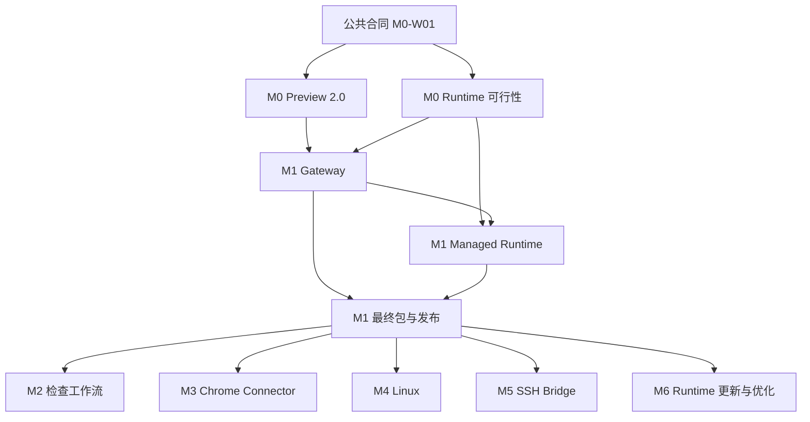

# 浏览器重构实施总索引

日期：2026-09-05。状态：整套设计与开发计划；产品开发尚未开始。

本目录将[浏览器总体设计](../../specs/2026-09-04-browser-rearchitecture-design.md)拆成十个工作包，覆盖 M0–M6 的全部路线。每包有独立规格、六个开发任务、依赖、负责角色、工程量、具体文件、测试命令、验收与失败处理。不能把六十项开发待办的文档完成理解为浏览器已经实现。

## 阅读顺序

1. [共用合同](../../specs/2026-09-05-browser-rearchitecture/00-contracts.md)：身份、wire、权限、接管、事件、数据与跨包边界。
2. 本页的工作包与开发顺序，选择依赖已满足的任务。
3. [需求与验收矩阵](acceptance-matrix.md)：BR-01 至 BR-24 的完整覆盖、平台和证据标准。
4. 对应工作包的规格和实现计划；每个任务按复选框记录实际进度。
5. [任务索引](task-index.json)：机器可读的六十项任务、依赖与工程量，由计划自动生成。

## 工作包

| 包 | 设计规格 | 开发任务 | 交付范围 |
| --- | --- | --- | --- |
| M0-W | [Preview 2.0](../../specs/2026-09-05-browser-rearchitecture/m0-preview.md) | [M0-W01–06](m0-preview.md) | Host任务组、真实导航、迁移、生命周期、native cover、完整手动工作台 |
| M0-R | [Runtime可行性](../../specs/2026-09-05-browser-rearchitecture/m0-runtime.md) | [M0-R01–06](m0-runtime.md) | 固定tuple、macOS/Windows原生输入、Guard、沙箱/凭据/动作取消可行性 |
| M1-G | [Gateway与权限](../../specs/2026-09-05-browser-rearchitecture/m1-gateway.md) | [M1-G01–06](m1-gateway.md) | 第一方MCP、身份/origin/审批、lease/接管、路由/审计、真实CLI |
| M1-R | [Managed Runtime](../../specs/2026-09-05-browser-rearchitecture/m1-runtime.md) | [M1-R01–06](m1-runtime.md) | worker、Profile、Supervisor、Artifact、上传下载、恢复 |
| M1-D | [打包与发布](../../specs/2026-09-05-browser-rearchitecture/m1-delivery.md) | [M1-D01–06](m1-delivery.md) | 签名分发、bootstrap、DMG/NSIS/portable、真实App更新交接、包CI、灰度与回滚 |
| M2 | [检查与Profile](../../specs/2026-09-05-browser-rearchitecture/m2-inspection.md) | [M2-01–06](m2-inspection.md) | Console/Network/Trace、真实截图、Design Mode v2、响应式、named Profile |
| M3 | [Chrome Connector](../../specs/2026-09-05-browser-rearchitecture/m3-chrome.md) | [M3-01–06](m3-chrome.md) | 扩展/native配对、显式认领与任务组、受限控制、撤销和能力对等验证 |
| M4 | [Linux](../../specs/2026-09-05-browser-rearchitecture/m4-linux.md) | [M4-01–06](m4-linux.md) | X11/Wayland能力准入、sandbox/凭据、三种包、真实支持矩阵 |
| M5 | [SSH Browser Bridge](../../specs/2026-09-05-browser-rearchitecture/m5-ssh.md) | [M5-01–06](m5-ssh.md) | 现有OpenSSH转发增强、隧道owner、origin隔离、取消/断连与诊断 |
| M6 | [独立更新与优化](../../specs/2026-09-05-browser-rearchitecture/m6-updates.md) | [M6-01–06](m6-updates.md) | Runtime独立签名更新、兼容回滚、资源预算、CEF可行性决策 |

M0 Preview 与 M0 Runtime 在公共类型确定后并行。M1内部可以按任务依赖开发，但 Gateway、Runtime 和最终包验收必须一起完成才是用户可用的首批 Agent Browser。M2–M5在M1基础上各自推进；M6复用稳定tuple/发布边界，不能在M1提前引入在线组件更新。

## 总体依赖



上图是工作包依赖摘要；真实执行顺序以任务级无环图为准。例如 M1-R03 在 G01 后即可开发，不必等待所有 Gateway 验收结束；最终集成仍要同时覆盖真实CLI和Runtime。M0 Runtime 的具体顺序为 R01 -> R04 -> R02 -> R03 -> R05 -> R06；R01 先固定构建合同，Guard 与 worker 完成后由 R06 汇聚完整签名 tuple，不要求第一项任务就交出尚不存在的组件。

## 实施节奏

| 批次 | 可启动工作 | 完成后检查点 |
| --- | --- | --- |
| 0 | M0-W01建立协议/owner/迁移fixture | 类型/序列化与幂等测试通过，冻结最小公共接口 |
| 1 | M0-W02–05 与 M0-R01–05 的已满足依赖任务 | Preview功能回归、三平台Runtime和输入可行性结果 |
| 2 | M0-W06、M0-R06 | 两份独立验收；不合格Runtime平台不进入M1 writer |
| 3 | M1-G、M1-R、M1-D中的就绪任务 | 内部可用完整Agent任务链，所有副作用与数据归属可追踪 |
| 4 | M1-G06/R06/D06 | 首批三个平台架构目标、四种发行组合金路径、签名/恢复/清理/CI齐套 |
| 5 | M2、M3、M4、M5 | 各自验收、独立flag和发布环，不把实验失败隐藏成成功 |
| 6 | M6安全更新、性能预算、CEF决策 | 更新与回滚实测；CEF只有Go/No-go结论，不自动替换Preview |

每个任务先提交最小行为测试并确认能复现缺失，再实现、验证、独立复核、commit和push。涉及多个平台的任务在每个平台逐fixture执行，不能一次大改后用“编译通过”代替验证。审阅以具体设计/代码/运行结果为对象。

## 开发角色与工程量

| 角色 | 主责 | 需要协作的边界 |
| --- | --- | --- |
| Browser/Host负责人 | 公共schema、生命周期、Gateway、grant/lease | 统一多包字段、状态与事件顺序 |
| 原生平台工程师 | macOS/Windows/Linux输入、窗口、Guard、签名 | 真机权限/进程身份/安全取消证明 |
| Runtime工程师 | 固定Node/Playwright/Chromium、Profile、Artifact | 公共协议、权限、打包与存储恢复 |
| React/UX工程师 | Workbench、检查面板、设置/对话框、i18n | 完整busy/error/empty/keyboard和native cover |
| 扩展工程师 | Chrome pairing/claim/受限adapter | Native companion、Host授权、浏览器版本矩阵 |
| QA/安全/发布工程师 | fixture、故障注入、真实包矩阵与发布 | 证据不可替代，失败保留可追溯记录 |

每项估算在对应任务内，是有经验工程师的主动工作量范围，不是日历承诺。总工程量和依赖层次从task-index汇总；并行可以缩短日历周期，但代码评审、真机资源、证书签名、扩展审核和beta观察仍有等待时间。不要把所有任务机械除以人数当成上线日期。

| 工作包 | 交付 | 主动工程日 |
| --- | --- | --- |
| M0-W | Preview 2.0 | 21–32 |
| M0-R | Runtime 可行性 | 22–34 |
| M1-G | Gateway 与权限 | 24–36 |
| M1-R | Managed Runtime | 29–41 |
| M1-D | 打包与发布 | 32–45 |
| M2 | 检查与 Profile | 24–37 |
| M3 | Chrome Connector | 27–43 |
| M4 | Linux | 21–33 |
| M5 | SSH Browser Bridge | 19–29 |
| M6 | 更新与优化 | 22–35 |
| 合计 | 全部工作包 | 241–365 |

估算包含各任务列明的实现与验证工作。原生输入、helper 导出、下载 broker 等先验实验失败时，先完成失败报告和方案修订，再重新估算返工；当前区间不能覆盖任意次数的技术路线重选。

## 外部前提与失败分支

| 前提或实验 | 确定它的任务 | 不满足时 |
| --- | --- | --- |
| 受支持Grok Build版本与真实official/custom测试身份 | M1-G06 | 保留not_run，不能用mock声称连接矩阵完成 |
| Apple Developer签名/公证、Windows Authenticode | M0-R01、M1-D02/D03 | Managed官方包保持Draft，社区包仅Preview/manual |
| Intel或真实x64 VM、Windows普通用户设备 | M0-R02/R03、M1-D04 | 对应平台验收未完成，不用交叉编译替代 |
| 原生输入来源与可靠取消primitive | M0-R02/R03/R05 | 相关平台/action不授writer，保存No-go并调整设计后继续 |
| 凭据静态保护与Profile安全锁 | M0-R04/R05、M1-R04 | persistent关闭或平台No-go，不能自动退回明文Profile |
| Chrome逐claim控制/下载归因与helper可维护性 | M3-03/M3-04/M3-06 | 能力缺口明确未完成；人工路径不算Agent对等验收 |
| Wayland输入API/组合支持 | M4-02 | 明确支持矩阵与No-go，不声称全Linux自动化完成 |
| 更新信任根/撤销策略与离线bootstrap | M1-D01、M6-01–04 | 新Managed绑定阻断，Preview保留 |

这些是开发任务要取得证据的前提，不是本次文档编写被阻塞。可行性No-go本身可以完成实验报告，但不能把对应产品能力的开发任务自动标通过；必须调整方案或由维护者明确变更发布范围后重新验收。

## 仓库与变更约束

- 工作分支 `codex/browser-rearchitecture`，实现时各工作包从已核对基线创建独立 `codex/` 分支与worktree。
- 遵循 `AGENTS.md` 和 `docs/llm-wiki/`；新状态放领域模块，App shell + AppWorkbench总行数不增长。
- 当前代码质量门千行文件79/77，M0-W02/W05在经手模块内拆分并验证，不提高预算。
- 浏览器原生modal-cover修复是独立工作；每次实现前核对其是否已进基线，不覆盖独立WIP。
- UI文案同步15语言；每个设置登记search/deep link；禁用window dialogs、系统select、透明菜单和点击穿透。
- 本地CI通过才提出PR；UI/IA新界面合并遵守维护者审阅；本地commit同轮push。
- 合并后依照ancestor/PR/内容证据清理完成分支与空闲worktree，不删除唯一WIP。

## 计划校验与更新

`verify-plan.mjs` 使用Markdown AST检查十对spec/plan、共用合同、总索引、验收矩阵、总体设计和交接记录，共二十五份Markdown；同时检查六十任务、必需元数据、每任务六步骤/代码/命令、JSON示例、依赖语法/无环性/进入门可达性、相对链接、BR需求映射及本页工程量摘要，并生成task-index。它只验证文档可追踪性，不验证产品实现。

```bash
node docs/superpowers/plans/2026-09-05-browser-rearchitecture/verify-plan.mjs --write-index
node docs/superpowers/plans/2026-09-05-browser-rearchitecture/verify-plan.mjs
git diff --check
```

计划正文是任务元数据和状态的编辑源，task-index是派生文件。完成实际任务后更新复选框与验收记录再重建索引；不能手改JSON把任务标完成。增加/拆分任务或改变进入门要同时更新依赖、BR映射和校验器预期合同；工程量调整要同步本页表格，校验会拒绝过期摘要。

## 当前交付状态

本次交付包含整套规格、六十项开发任务、三百六十个任务步骤与验收/依赖索引；开发待办全部未勾选，另外十二项工作包交接检查不计入任务步骤。所有平台实验、实际浏览器运行、签名打包和发布结果保持未执行。本目录可用于逐包组织开发，不应把其中的预期命令输出当作已经运行的事实。
